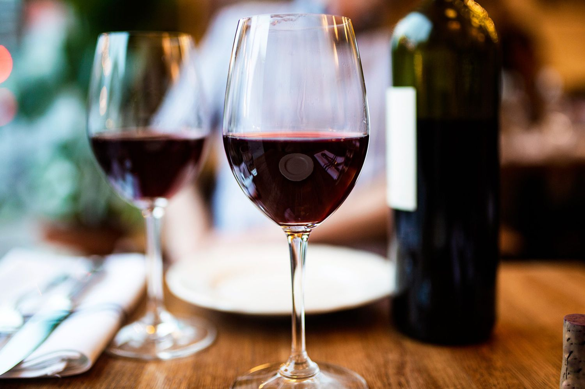

```{r setup, include=FALSE}
library(tidyverse)
library(caret)
library(data.table)
library(GGally)
library(tidymodels)
library(car)
library(scales)
library(lmtest)

options(scipen = 100, max.print = 1e+06)
```
# Intro 


```{r, out.width = "100%", echo = FALSE, fig.align = "center"}

```
Red wine is a type of wine made from dark-colored grape varieties. The color of the wine can range from intense violet, typical of young wines, through to brick red for mature wines and brown for older red wines. The juice from most purple grapes is greenish-white, the red color coming from anthocyan pigments present in the skin of the grape. Much of the red wine production process involves extraction of color and flavor components from the grape skin. _source: wikipedia_

Four Indicators of Wine Quality

1. Complexity

Higher quality wines are more complex in their flavor profile. They often have numerous layers that release flavors over time. Lower quality wines lack this complexity, having just one or two main notes that may or may not linger.

With high-quality wines, these flavors may appear on the palate one after the other, giving you time to savor each one before the next appears.

2. Balance

Wines that have good balance will be of higher quality than ones where one component stands out above the rest.

The five components – acidity, tannins, sugar/sweetness, alcohol and fruit – need to be balanced. For wines that need several years of aging to reach maturity, this gives them the time they need to reach optimal balance.

Higher quality wines don’t necessarily need moderation in each component – indeed, some red wines have higher acidity while others have a higher alcohol content. What makes the difference is that the other components balance things out.

3. Typicity

Another indicator of wine quality comes from typicity, or how much the wine looks and tastes the way it should.

For example, red Burgundy should have a certain appearance and taste, and it’s this combination that wine connoisseurs look for with each new vintage. An Australian Shiraz will also have a certain typicity, as will a Barolo, a Rioja or a Napa Valley Cabernet Sauvignon, among others.

4. Intensity and Finish

The final indicators of both white and red wine quality are the intensity and finish. High-quality wines will express intense flavors and a lingering finish, with flavors lasting after you’ve swallowed the wine. Flavors that disappear immediately can indicate that your wine is of moderate quality at best. The better the wine, the longer the flavor finish will last on your palate.
_source_
https://www.jjbuckley.com/wine-knowledge

it very important for wine factory to produce high quality wine. 
let try it by using data set provided!

# Data Preparation

i'm using data set from kaggle.com Redwine Quality
https://www.kaggle.com/datasets/uciml/red-wine-quality-cortez-et-al-2009


let's take a look at the data
```{r}
wine <- read.csv("winequality-red.csv")

rmarkdown::paged_table(wine)
```

Columns Description:

* `fixed acidity`: most acids involved with wine or fixed or nonvolatile (do not evaporate readily)
* `volatile acidity`: the amount of acetic acid in wine, which at too high of levels can lead to an unpleasant, vinegar taste.
* `citric acid`: found in small quantities, citric acid can add 'freshness' and flavor to wines
* `residual sugar`: the amount of sugar remaining after fermentation stops, it's rare to find wines with less than 1 gram/liter and
* `chlorides`: the amount of salt in the wine
* `free sulfur dioxide`: the free form of SO2 exists in equilibrium between molecular SO2 (as a dissolved gas) and bisulfite ion;
* `total sulfur dioxide`: amount of free and bound forms of S02; in low concentrations, SO2 is mostly undetectable in wine, but at free SO2
* `density`: the density of water is close to that of water depending on the percent alcohol and sugar content
* `pH`: describes how acidic or basic a wine is on a scale from 0 (very acidic) to 14 (very basic); most wines are between 3-4
* `sulphates`: a wine additive which can contribute to sulfur dioxide gas (S02) levels, wich acts as an antimicrobial 


```{r}
dim(wine)
```
this data set contains 1599 rows and 12 columns

check the missing values since it will affect our work process

```{r}
anyNA(wine)
```
so there is no NA values and then check data type using `glimpse` by `dplyr` library
```{r}
glimpse(wine)
```

Since i'm gonna using Linear Regression method and this method needs  numeric predictors, i'll keep those data in their original data type.


# Exploratory Data Analysis

For short view let's check the correlation between target and it's predictors.

```{r}
ggcorr(wine, label = TRUE, label_size = 2.9, hjust = 1, layout.exp = 2)
```
the figure above gives view that there are not strong correlation between target which is quality and other variables.
beside that between variables have strong correlation such as fixed acidity to citric acid and density,
free sulfur dioxide to total sulfur dioxide. It's indicate that we couldn't use naive bayes method since all variables aren't equal. But let's work on as it is.

next step is checking the outliers.
```{r}
plot1 <- boxplot(wine, las = 2)
```

There are outliers  in total sulfur dioxide and free sulfur dioxide so i decided to eliminate those outliers.


```{r}
wine_clean <- wine %>% filter(total.sulfur.dioxide < 160 , free.sulfur.dioxide < 60 
                              )
plot2 <- boxplot(wine_clean, las = 2)

```

# Modeling

## Step and Train-Test Split

Using `step` for decide model with correct predictors ,
```{r}
wine_lm <- lm(quality ~ ., data = wine_clean)
```
```{r}
stats::step(wine_lm, direction = "backward")
```
splitting wine_clean into data training and data test.
```{r}
set.seed(123)
samplesize <- round(0.7 * nrow(wine_clean), 0)
index <- sample(seq_len(nrow(wine_clean)), size = samplesize)

data_train <- wine_clean[index, ]
data_test <- wine_clean[-index, ]
```


## Linear Regression


```{r}
set.seed(123)
wine_lm <- lm(quality ~ ., data = data_train)

summary(wine_lm)
```

Value 0.75 for Adjusted R- squared  used as parameter for good model and the calculation from my model is  0.3373, giving me assumption that the model built by all predictors not suitable to predict unseen data.

Using predictors stated by step method let's have look of the results below.

>lm(formula = quality ~ volatile.acidity + chlorides + free.sulfur.dioxide + 
  total.sulfur.dioxide + pH + sulphates + alcohol, data = wine)$$

```{r}
wine2 <- wine_clean %>% 
  select(quality,volatile.acidity, chlorides , free.sulfur.dioxide ,
    total.sulfur.dioxide , pH ,sulphates , alcohol )
data_train2 <- wine2[index, ]
data_test2 <- wine2[-index, ]

set.seed(123)
wine_lm2 <- lm(quality ~ ., data = data_train2)

summary(wine_lm2)
```

Adjusted R-squared with new model have no huge different number it's about 0.0005.


# Evaluation

## Model Performance

To see all models performance, i calculate Root Mean Squared Error (RMSE) 

this one from the 1st model
```{r}
wine_pred <- predict(wine_lm, newdata = data_test %>% select(-quality))

#RMSE of train dataset
RMSE(pred = wine_lm$fitted.values, obs = data_train$quality)
```

```{r}
#RMSE of test dataset
RMSE(pred = wine_pred, obs = data_test$quality)
```

this one from second model.

```{r}
wine_pred2 =  predict(wine_lm2, newdata = data_test2 %>% select(-quality))

#RMSE of train dataset
RMSE(pred = wine_lm2$fitted.values, obs = data_train$quality)
```
```{r}
#RMSE of train dataset
RMSE(pred = wine_pred2, obs = data_test2$quality)
```


# Conclusion
Smaller RMSE indicate that model is good.
Looking at models above. It show that the second model slightly better than 1st model.

But as analyst we need to consider that Ggally figure and adjusted R square calculate that all predictors don't show strong correlation, and consider to using other ML method such as Logistic Regression.


